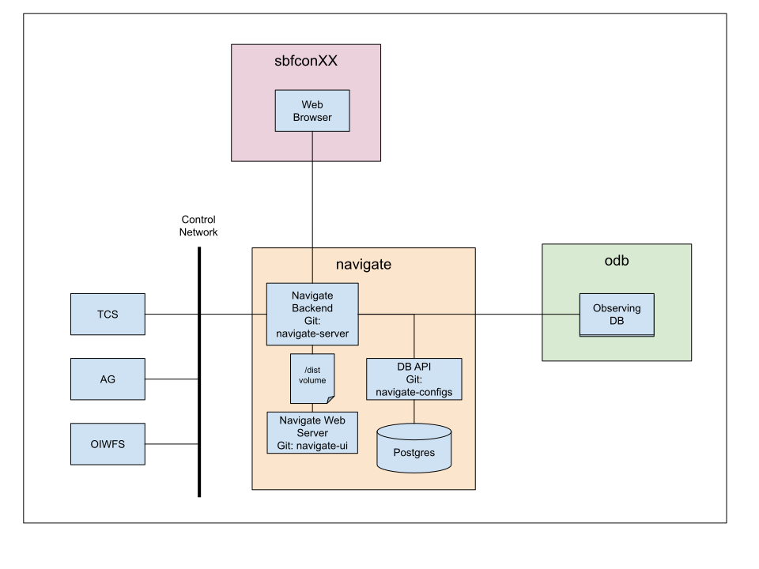

# Navigate deploy

Navigate was built using multiple services, currently four docker containers are needed to start the entinre project, these containers are

- server: It is the scala backend in charge of the communication with the real devices, also starts a webserver to serve the ui compiled files and a proxy to route the client requests to the configs container.
- ui: The container which compiles the UI files developed using react/typescript and stores them in a volume shared with the server.
- configs: Is the graphql API developed in typescript using Apollo to connect the ui and the database container, the server works as a proxy to route the ui requests.
- database: The Postgres database to host multiple configurations required by the UI and display the current used configuration and targets.

The following diagram represents the current architecture


## Compose

Server, ui and configs containers are started from custom docker images which are hosted in dockerhub using the noirlab software account **nlsoftware**. The database container is started from the default postgres image also hosted in dockerhub.

This repository includes two template files:

- **template-env** is the template for the environment variables that will be used by the docker compose command, if you do not want to explicitely provide the environment file, **template-env** should be copied to **.env** and modified to match your needs.
- **template-ui-env** is the file with the VITE environment variables used during the vite build process, make sure its path and file name match with the environment variable named **UI_ENV_FILE** used in the first file.

If the previous files are already configured the system can be started using the following command (Explicitely using the template-env)

```bash
docker compose -f docker-compose.yml --env-file template-env up -d
```

# Local development configuration

The system can be started locally for development purposes, I highly recommend to use this docker-compose.yml file to start the database container only `docker compose -f docker-compose --env-file template-env up -d database`, otherwise a local installation of postgres database is required.

## Configs repo

### Requirements

- Node
- Environemnt file (.env) with **DATABASE_URL** and **SERVER_PORT** variables

### Running

In the navigate-configs repository run the following commands

```bash
# Install dependencies
npm install
# Generate database schema
npx prisma migrate dev
# Populate initial configuration
npm run populate
# Run the server
npm start
```

## Server

### Requirements

- SBT
- JAVA 17 or greather

### Running

Commands

```bash
# Start webserver
sbt navigate_web_server/reStart
```

## UI

### Requirements

- Node
- Environment file (.env.local) with variables **VITE_ODB_URI** with the observing database url, **VITE_NG_SERVER_URI** Navigate server graphql url, **VITE_NG_CONFIGS_URI** navigate server configs proxy url, **VITE_NG_WS** navigate server websocket url

### Running

Commands:

```bash
# Install dependencies
npm install
# Run webserver
npm run dev
```
